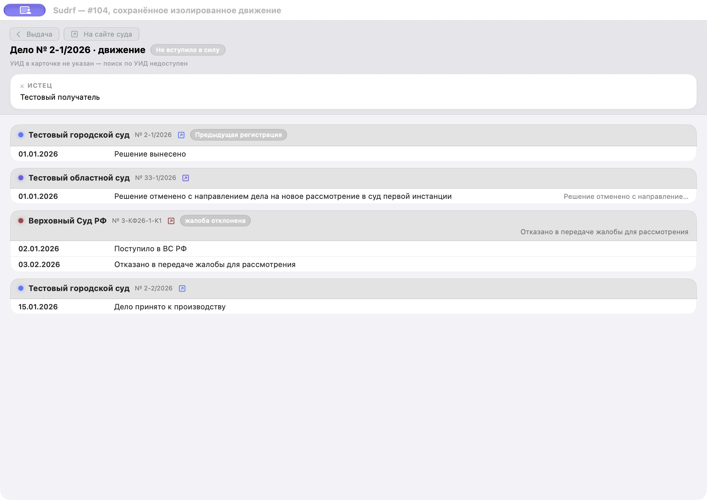

# #104 / #262 — полнота поиска ВС РФ

Даты проверки: **9 и 10 октября 2026 года**. Проверен узкий контракт списка производств ВС РФ; общая задача #104 остаётся открытой.

## Текущий checkpoint

Интегрирован `origin/main` `8a7f0e8245d7275dcd879692b998560c33ef9d9f`,
с сохранением транспортных и parser изменений этой ветки. Изолированный
сквозной RefreshCenter → SwiftData → reopen → repeat/partial профиль
и независимый review пройдены. Root выполнил нативный просмотр именно
сохранённого синтетического движения; QA host подтверждённо закрыт.
Подтверждение пользователя по показанному снимку пока ожидается.
Current-SHA hosted CI обязателен; прежние зелёные запуски ниже исторические.
Широкая живая приёмка #104 остаётся открытой.

После интеграции основной ветки повторены 3 профильных XCTest:
0 ошибок/пропусков, 0,241 секунды; лог
`/private/tmp/sudrf-104-main-integration-profile.log`, SHA-256
`ab65fb27e762182d449565821745d4a12eef6d0d0993ab1e2d56093da5c75ea2`.
QA host пересобран без запуска; лог
`/private/tmp/sudrf-104-main-integration-gui-build.log`, SHA-256
`4ae82d60e133d9f3660e5c10bf50598838add9ce317c681ae3ce50f2dc3df042`.

## Поведение

После успешного поиска по УИД и после успешного поиска по номеру первой инстанции `MovementService.vsrfInstancesOutcome` теперь помечает источник неполным, если опубликованное `total` превышает число сырых строк `results`. Проверка выполняется до фильтрации по УИД, суду и номеру. Уже возвращённые строки продолжают сопоставляться и гидратироваться штатно. Неполнота накапливается между двумя поисками и не сбрасывается успешным ответом второй ветки.

Если распознанный опубликованный `total == results.count`, выдача остаётся полной, даже когда фильтр сопоставления отбрасывает чужие производства. Без распознанного счётчика положительная выдача сохраняет полезные строки, но не подтверждает полноту источника. Существующие правила сопоставления, порядок запросов, обработка ошибок и отмены, а также гидратация карточек не менялись. Пагинация не добавлялась.

## Регрессии и границы

Добавлены синтетические случаи:

- частичный поиск по УИД вместе с полной выдачей по номеру сохраняет найденное производство и помечает источник неполным;
- полный поиск по УИД вместе с частичной выдачей по номеру сохраняет совпавшие строки обеих выдач и помечает источник неполным;
- `total`, равный числу сырых строк с посторонними судами/УИД, не становится неполным только из-за последующей фильтрации;
- две полные выдачи остаются полными;
- полный `MovementService.movement` отражает частичность в `sourceRefreshCoverage`, сохраняет identity успешно загруженной строки, а `MovementCachePolicy.merge` возвращает отсутствующий в свежем ответе VS-круг вместе со связью на акт и сохранённым текстом.

Новые сценарии используют только синтетические объекты `VSRFProduction` и локальные моки. Существующий тест потока санитизированных fixture проходит через перехватывающий `URLProtocol`; реальные сайты не запрашивались. Проверка ограничена SwiftPM-пакетами `SudrfKit` и его XCTest-таргетом: приложение, `AppRouter`, SwiftData, настройки и `NSUserActivity` не запускались и не использовались. Полный набор и сборка приложения здесь не выполнялись.

Отдельно root провёл один ограниченный live-запрос по номеру `2-8236/2025` на исходной базе `8403266` 9 октября 2026 года, 05:44:23.795–05:44:25.115 UTC. В санитизированном отчёте указана категория `parsing` (ошибка разбора/неизвестного формата), без строк, `total` и загрузки карточки; повторов не было. Отчёт: `/private/tmp/sudrf-104-probe-20261009/outcome.json`, SHA-256 `20998e09ec6cf3d6c82597218871d34c053543142b5c2fe3107814a24a5fb824`. Он не сохраняет исходный ответ, поэтому точная причина ошибки не установлена. Запрос не проверяет и не подтверждает гипотезу о `total > results.count`, не служит входом регрессионных тестов и не закрывает live-приёмку #104.

## Проверки

До двухстрочного исправления Kit-only профиль `VSRFMovementTests` завершился ожидаемым RED: **17 тестов, 5 ошибок**. Два новых теста выдачи не обнаруживали частичность; три assertion сквозного теста не видели partial coverage и восстановление кэшированного круга.

После исправления, в отдельной копии только `Sources/SudrfKit` и `Tests/SudrfKitTests` с минимальным SwiftPM manifest и локальным checkout SwiftSoup:

- `--filter VSRFMovement` — **23 XCTest, 0 ошибок** (17 `VSRFMovementTests`, 6 `VSRFMovementCacheTests`);
- `--filter MovementCachePolicyTests` — **23 XCTest, 0 ошибок**;
- `--filter VSRFCardParserTests` — **31 XCTest, 0 ошибок**.

Использовались изолированные build и module cache в `/private/tmp/sudrf-104-kit-red-20261009-01`. Команды запускались последовательно:

```sh
env SWIFTPM_MODULECACHE_OVERRIDE=/private/tmp/sudrf-104-kit-red-20261009-01/module-cache \
    CLANG_MODULE_CACHE_PATH=/private/tmp/sudrf-104-kit-red-20261009-01/clang-cache \
    swift test --package-path /private/tmp/sudrf-104-kit-red-20261009-01 \
      --scratch-path /private/tmp/sudrf-104-kit-red-20261009-01/build \
      --skip-update --filter VSRFMovement

env SWIFTPM_MODULECACHE_OVERRIDE=/private/tmp/sudrf-104-kit-red-20261009-01/module-cache \
    CLANG_MODULE_CACHE_PATH=/private/tmp/sudrf-104-kit-red-20261009-01/clang-cache \
    swift test --package-path /private/tmp/sudrf-104-kit-red-20261009-01 \
      --scratch-path /private/tmp/sudrf-104-kit-red-20261009-01/build \
      --skip-update --filter MovementCachePolicyTests

env SWIFTPM_MODULECACHE_OVERRIDE=/private/tmp/sudrf-104-kit-red-20261009-01/module-cache \
    CLANG_MODULE_CACHE_PATH=/private/tmp/sudrf-104-kit-red-20261009-01/clang-cache \
    swift test --package-path /private/tmp/sudrf-104-kit-red-20261009-01 \
      --scratch-path /private/tmp/sudrf-104-kit-red-20261009-01/build \
      --skip-update --filter VSRFCardParserTests
```

Локальные логи остаются в scratch: `red.log`, `green-movement-final.log`, `cache-policy.log`, `card-parser.log`.

Root отдельно повторил общий профиль `VSRFMovement|MovementCachePolicyTests|VSRFCardParserTests`: **77 XCTest, 0 ошибок**. Перед запуском SHA-256 скопированных `Movement.swift` и `VSRFMovementTests.swift` совпали с веткой. Лог `/private/tmp/sudrf-104-root-profile-20261009.log`, SHA-256 `ea606ad02f9811cffb5f4ff5c2ff83b00219afd0e28f359849af17ca68c53387`.

Генератор registry с `--check` подтвердил актуальность; Xcode-проект пересоздан после проверки трёх неизменённых моделей по manifest. Генерация не является сборкой приложения. Локальный app-build и системная регистрация приложения не выполнялись; полный набор и сборку проверит CI. Xcode 27 на этой ветке ещё не проверялся.

## Положительная выдача без счётчика

Дополнительный контрпример от 9 октября 2026 года удаляет только строку
«Найдено: 1» из существующей санитизированной положительной фикстуры.
Настоящие parser и `vsrfInstancesOutcome` сохраняли одну полезную карточку,
но ошибочно возвращали `incomplete == false`. RED-лог SHA-256:
`526b02d00b028ff1a76b02f6a0d018b652de77f50fe22c92f7f4e5176573d38f`.
Это синтетическая проверка контракта, не ответ живого сайта и не установленная
причина отсутствия исходной жалобы #104.

Внутренний признак сохранённого опубликованного счётчика теперь передаётся
от parser до обеих поисковых веток MovementService. Публичные поля и
инициализатор не изменены; совместимое `total` без счётчика остаётся лишь
нижней границей. Неполнота не сбрасывается полным ответом другого поиска.
Тест проверяет неизвестную полноту по УИД, по номеру и одновременно в обеих
ветках. Неизвестная пустота и противоречивые счётчики по-прежнему отклоняются.

Профиль `VSRF(CardParser|Movement)Tests` прошёл 49 XCTest, 0 ошибок;
SHA-256 GREEN-лога `4e2468a4f8a543776ad0e1f8e91982790411265f38f705da19d737be9911d0bc`.
Исполнялись только Kit-тесты, без приложения, SwiftData и живых запросов.
Независимый Astra review этой дельты: Ship. Повтор current-SHA hosted CI и
сборка остаются обязательными. Общая живая приёмка #104 не завершена.

## Опубликованные участники в новом формате строк — 10 октября

Один диагностический запрос 10 октября 2026 года, 01:52:01–01:52:02 UTC,
получил конечный HTTP 200 после разрешённого перенаправления на `www.vsrf.ru`.
Ответ: 218168 байт, SHA-256
`b9e2d76b21abcd4f6cb266605dfb04ada8fb2e45bc1b2b00e94b019ca81b9d48`.
Использована ephemeral URLSession с заголовками и проверкой допустимого хоста
штатного клиента, без cookies/cache и без обхода TLS; это диагностическая
обёртка для сохранения байтов, не вызов `VSRFClient`.

На HEAD `9298552730dbc409a840dbc6313a5e1c332f3c66` parser отклонял обе строки:
поля заявителя опубликованы в `RowElement_container__` с `CaseStyle_case_value__`,
а общий `currentMetadata` читал имена только из прежних personalList-строк.
УИД отсутствовал; потеря имени не позволяла пройти существующую проверку
привязки по суду, номеру первой инстанции и заявителю. Это доказанная причина
отказа именно на сохранённом ответе 10 октября; исходный ответ неудачной
попытки 9 октября отсутствует, её причину этому исправлению не приписываем.

Общий helper поиска и карточки теперь читает оба формата имён. Для новых
строк требуется отдельный элемент значения: подпись пустой строки не становится
именем заявителя. Приоритет «В интересах», прежний разбор нескольких имён,
строгое сопоставление и гидратация не изменены.

Минимальная фикстура `vsrf_current_search_row_parties.html` сохраняет только
структуру классов и подписей полученного ответа; все имена, номера, даты и
идентификаторы заменены синтетическими. SHA-256 фикстуры:
`e9efd06bb3c8b1aa5fc9faad9741ce9230f0c6b69b6b3b267795bd53e80eb34a`.
Исходные байты и заголовки остаются локально, в PR не публикуются.

Четыре новые регрессии до исправления: **3 падающих метода, 6 assertion failures**;
отрицательный случай отсутствующих/пустых/пробельных значений проходил.
SHA-256 RED-лога `4573990f3fb0a831510cc41bc4d68b0298a327765dafd4c32f16b1da04cfb1a6`.
После исправления: **35 тестов parser, 0 ошибок**. После обновления ветки на
main `bd06f4ef19922f311ece19df3167296a80d26756`: **82 профильных Kit-теста,
0 ошибок**, включая движение ВС РФ и объединение кэша; SHA-256 лога
`83878a1ef94e408243b32d0a8ed7ce08c8ad5e81b84245c2721e5244aa088b96`.
Независимый статический Astra review: замечаний нет; тесты reviewer не запускал.

Без нового сетевого запроса исправленный parser повторно обработал сохранённые
исходные байты: **2 строки, опубликованный total 2**, участники извлечены в обеих.
Обезличенный локальный результат `parser-fixed.json`, SHA-256
`e0ca89302def1ac532b25263d9e1a484e05fb6ab9df1e4d280df60ab8653b2b2`.
Этот результат подтверждает разбор ответа, но не принадлежность найденных
производств делу пользователя. Загрузка их карточек и сквозное сохранение
не проверены; общая живая приёмка #104 остаётся открытой.

Генератор registry подтвердил актуальность; все три готовые CAPTCHA-модели
совпали с manifest. После rebase проект пересоздан и собственная Debug-сборка
успешно собрана **Xcode 27.0 (27A266a)**, без запуска приложения. SHA-256 лога
сборки `d606ed000f99a5eb29719c4b6d3d43a7e0fd19e329baf4e3ed80257faf3e38e3`.
Рабочее хранилище, установленное приложение и TestFlight не использовались.
Полный App-набор локально не запускался; его и CI проверяем на новом HEAD PR.

## Вторая диагностика: собственная карточка жалобы

10 октября 2026 года, **02:08:51–02:08:54 UTC**, root выполнил один
ограниченный проход настоящего `VSRFClient` и
`MovementService.vsrfInstancesOutcome` на коде `c294fac55614523e816aff52d8173ecf0bdc4a95`.
Вход — суд и номер первой инстанции из #104, фамилия с production-нормализацией;
УИД не подтверждён и передан как `nil`. Известная карточка ВС РФ не подставлялась.
Использованы ephemeral sessions без cookies/cache, production User-Agent,
обычная проверка TLS, одна попытка и интервал 1,5 секунды. Бюджет — четыре
логических запроса и не более двух перенаправлений на каждый; фактически
выполнены **два запроса**, оба HTTP 200.

Выдача распознана: **2 строки, опубликованный total 2**. Ожидаемая жалоба
`3-КФ26-187-К3` найдена ровно один раз; нормализованные суд, номер первой
инстанции и фамилия совпали. Затем клиент штатно запросил её собственную
карточку `/lk/practice/claims/21-36956256`. Итог движения остался неполным:
одна инстанция без подтверждённой загруженной native identity, поскольку
карточка не прошла parser. Это не успешная живая приёмка.

Отдельный offline reparse сохранённых байтов подтвердил ошибку:
«В карточке ВС РФ нет проверяемого номера или ID производства». Native anchor
присутствовал; номер в собственном title span оканчивался **точкой и NBSP**,
которые прежняя проверка номера не принимала. Это не объединение номера
с подписью «Жалоба». Карточка также публикует дату поступления в metadata row
и собственный датированный результат в отдельном `CaseStyle_appealEventRow__`;
полного `CaseStyle_eventsRow__` и `FinalActRow_*` в ответе нет. Ссылки на
опубликованный PDF этим ответом не подтверждены.

Локальные raw-доказательства сохранены вне репозитория в
`/private/tmp/sudrf-104-source-20261010/client-acceptance/`:

- search: 218168 байт, SHA-256 `b9e2d76b21abcd4f6cb266605dfb04ada8fb2e45bc1b2b00e94b019ca81b9d48`;
- own card: 174890 байт, SHA-256 `a0ce814af1786fcae0253a6011aa2a001759fdd0f7ad6e76b725c937ae305b60`;
- `offline-diagnosis.json`: SHA-256 `fd981fa184af23faa1acf1d400834627ff023fe3c00399ddea008ee325fa3bee`.

Raw страницы, заголовки, участники и тексты в PR не публикуются. Диагностический
harness и исходные результаты сохранены; offline разбор не делал новых запросов.

### Исправление и регрессии

Коммит `c458352edc2fb63daa18f100fbaa77162b7aa009` принимает номер с допустимым
конечным оформлением и только проверенный собственный формат жалобы с отдельным
датированным результатом. Дата поступления становится собственным датированным
событием; результат сохраняется в движении без выдуманного PDF или полного
списка событий. Сопоставление нижестоящего дела не ослаблено.

Санитизированная fixture сохраняет DOM-структуру, но заменяет номера, ID, имена,
даты и текст результата синтетическими значениями. До исправления положительный
сценарий падал с той же ошибкой; отрицательные сценарии продолжали отклоняться.
Проверены отсутствие результата, missing/blank date или value, неоднозначные
номера, несколько direct rows, отсутствие заголовка полного movement section
и запрет такого fallback для `.caseFile`. Найденный Astra отдельный P1 — полностью
пустая direct row без intake — воспроизведён RED и закрыт post-loop guard.

Логи и фактические результаты:

- исходный complaint DOM RED: 3 теста, 1 failure; SHA-256 `db06a329a94b9e14af5a545bb7fd89b3a40a03a2a7f0da547557f7fab496c2e2`;
- blank-row RED: 1 тест, 1 failure; SHA-256 `ee04e899f24756146349d72f2eb0e3ffab629975eee78c91bfe825ca12aa618a`;
- final focused GREEN: 6 тестов, 0 failures/skips; SHA-256 `8903422d04562663a00899caa5eafeff6dbba0df2cfa515d4ac327d554443a04`;
- root final Kit profile: **87 тестов, 0 failures/skips**, лог `/private/tmp/sudrf-104-complaint-root-full-profile.log`, SHA-256 `864345872b8bfee130b1c7d5a8f04e1354f312b5a1fad372851fae550204d8ab`.

Kit-интеграция проходит parsed search → собственная parsed card → hydrated
`.vsCassation`, проверяет native identity/source URL, intake/refusal, отсутствие
фиктивного PDF и повторный результат без дубликатов. JSON roundtrip движения
сохраняет URL; это **не SwiftData disk reopen** и не проверка RefreshCenter.
Независимый Astra final review: **Ship** после исправления пустой строки.

Собственная Xcode Debug-сборка: **BUILD SUCCEEDED**, приложение не запускалось.
Лог `/private/tmp/sudrf-104-complaint-xcode-build.log`, SHA-256
`daa4a72566537b6a438db2a1848e6c28b3595ae60a18159bb8d144fe33c4b4a9`.

### Повторный live-проход на исправленном коде

Root повторил ограниченный настоящий client-проход на `c458352` 10 октября
2026 года, **02:20:29.940–02:20:32.475 UTC**. Два HTTP 200; search и own card
имеют те же размеры и raw SHA-256, что до исправления. Результат: **одна
инстанция `3-КФ26-187-К3`, `incomplete=false`**, подтверждённая native identity
`vsrf / vsrf.ru / claims / 21-36956256` и собственный source URL
`https://www.vsrf.ru/lk/practice/claims/21-36956256`. Проверки собственной даты
поступления **19 июня 2026 года** и собственного отказа **11 августа 2026 года**
прошли. Опубликованных PDF-актов — **0**; их наличие не выдумывается.

Локальное сохранение и повторное чтение JSON движения в изолированном каталоге
прошло (`diskJSONRoundtrip=true`). Это не SwiftData/store lifecycle.
Материалы: `/private/tmp/sudrf-104-source-20261010/client-acceptance-fixed/`.
В репозиторий включён только [санитизированный отчёт](live-client-2026-10-10.json) с результатами, временем и хешами; raw HTML и участники туда не включены.
SHA-256 `outcome.json`: `88e6ba6c1d60a86e86059142a40136bd3f0a310f1c5fc2fa7ef648e162f5d5b9`;
исходник harness: `ad5c55c5b9e99b351cb47b347078b2d1c52884c04175d48e3907708d83cb3e43`.

[Hosted CI прежнего `c294fac`](https://github.com/arvidsever/Sudrf/actions/runs/38015415734)
прошёл; это не CI текущего нового HEAD. Hosted Xcode 27 steps были пропущены;
локальная Xcode 27 сборка выше действительно выполнена. Current-HEAD CI ещё ожидается. На прежнем `c294fac` выполнено 2045 тестов: 20 skipped, 0 failures.

Подтверждён source discovery и hydration конкретной жалобы на проверенном
ответе. Сквозная приёмка SwiftData/RefreshCenter и GUI не выполнена; рабочая
база, установленное приложение и TestFlight не использовались. Остальные
критерии общей задачи #104 остаются открытыми.

## Чистая проверка стадии — 10 октября 2026 года

В `Issue104LifecycleTests` добавлены два синтетических сценария без клиентов,
хранилища, AppRouter и общих настроек. Настоящий `CaseLifecycleResolver`:

- завершает самостоятельную отказанную жалобу как terminal review; её
  процессуальная принадлежность — кассация, а не надзор;
- сохраняет новый нижестоящий круг, начавшийся между поступлением старой
  жалобы и отказом ВС РФ, во всех шести порядках массива инстанций.

**2 XCTest, 0 ошибок/пропусков**. Лог
`/private/tmp/sudrf-104-lifecycle-pure-profile.log`, SHA-256
`2dd6129adf808054b731e7cda481830b0dbafaceb4ad7ed654962bfa22222dc3`.
Независимый Astra review: Ship.

Эти тесты вручную создают `CaseInstance`; разбор и отображение собственной
карточки покрыты отдельными Kit-тестами. Это не единый непрерывный тест
parser → lifecycle и не утверждение о стадии реального нижестоящего дела.
Проверки пустых актов и `inForce:false` лишь фиксируют синтетический вход;
они не доказывают отсутствие опубликованного PDF или правовую силу реального
дела. SwiftData/RefreshCenter и GUI остаются открытыми критериями.

## Сквозное сохранение обнаруженной жалобы — 10 октября 2026 года

Изолированный профиль `Issue104RefreshIntegrationTests|Issue104LifecycleTests`
исполнен на этой ветке: 3 XCTest, 0 ошибок и пропусков, 0,245 секунды.
Лог `/private/tmp/sudrf-104-refresh-final-profile.log`, SHA-256
`931d7829a00f904eb7bebcf284a3b82fea8484704e532a923261b86d75c01672`.

Настоящий VSRFClient с ephemeral URLSession получает существующие
синтетические HTML-фикстуры только через строгий URLProtocol: запрос по
номеру нижнего дела, затем опубликованная в выдаче claims-карточка.
Неизвестный запрос проваливает тест. Нижние HTML-карточки разбирает
штатный CaseCardParser; RefreshCenter и MovementService штатные.
Минимальная DI устраняет создание общих клиентов при переданных подменах
и изолирует хранилище CAPTCHA-токенов. Живых запросов нет.

Проверены disk → новый ModelContainer → повторное обновление без
дубликатов → частичный ответ с сохранением старой жалобы, пользовательских
коллекций, addedAt, журнала и нижнего акта. Первый refresh с новыми
событиями штатно сбрасывает seenAt; reopen/repeat/partial сохраняют nil. Сохранённая обнаруженная жалоба
имеет собственные номер, даты и native locator claims/21-00000001;
исходные record key и logicalID сохраняются. Это identity обнаруженного
движения, не отдельная VS-карточка в anchor identity graph. Активный
нижний круг после возвращения не завершается отказом ВС.
Ошибки первоначальных итераций были ошибками тестового harness
(ожидаемый host, разметка заголовка, anchor assertion), а не RED продукта.

Опция `SUDRF_104_EVIDENCE_DIRECTORY` сохраняет только собственную
синтетическую базу и manifest для отдельного процесса. Финальный manifest:
`/private/tmp/sudrf-104-refresh-native-evidence/persisted-store.json`.
`GUIHost.swift` открывает исключительно movement из указанной частной
базы; обязательны отдельный bundle ID и частный путь. Нет AppRouter,
refresh, общих cookies, публикации Spotlight, уведомлений и activity.
Настройки AppKit относятся к отдельному bundle `ru.sudrf.qa.vsrf104.disk`.
Сеть блокируется URLProtocol, открытие внешних ссылок — openURL.
Закрытие последнего окна завершает процесс; есть отдельное меню выхода. `build-gui-host.sh` собирает без запуска.
Сборка выполнена; лог `/private/tmp/sudrf-104-gui-build.log`, SHA-256
`4ae82d60e133d9f3660e5c10bf50598838add9ce317c681ae3ce50f2dc3df042`.
Независимый review этой дельты: PASS. Current-SHA CI остаётся gate. Полный local suite не запускался из-за стандартных
настроек других тестов. Это не закрывает живую приёмку #104.

### Нативный просмотр сохранённой базы

10 октября 2026 года root открыл отдельный QA host в новом процессе
и проверил штатный CaseMovementView, загруженный из manifest выше.
Видны нижнее возвращение, собственная жалоба 3-КФ26-1-К1 с точной
ссылкой `/lk/practice/claims/21-00000001`, события поступления
2 января 2026 года и отказа 3 февраля 2026 года, затем активный
нижний круг 2-2/2026. Несуществующий акт ВС не добавлен.
Root завершил QA host через Command-Q и подтвердил закрытие по
новой CUA-инвентаризации: собственный bundle больше не запущен.
Скриншот показан пользователю; его подтверждение ещё не получено.



SHA-256 JPEG:
`2b64f0bea218ff8ff5a345e0ded0f64be7ad7453ddbb46fcc62b6ca30aace478`.
Это нативная офлайн-приёмка синтетического disk pipeline, не приёмка
живого дела #104 и не разрешение слияния.
