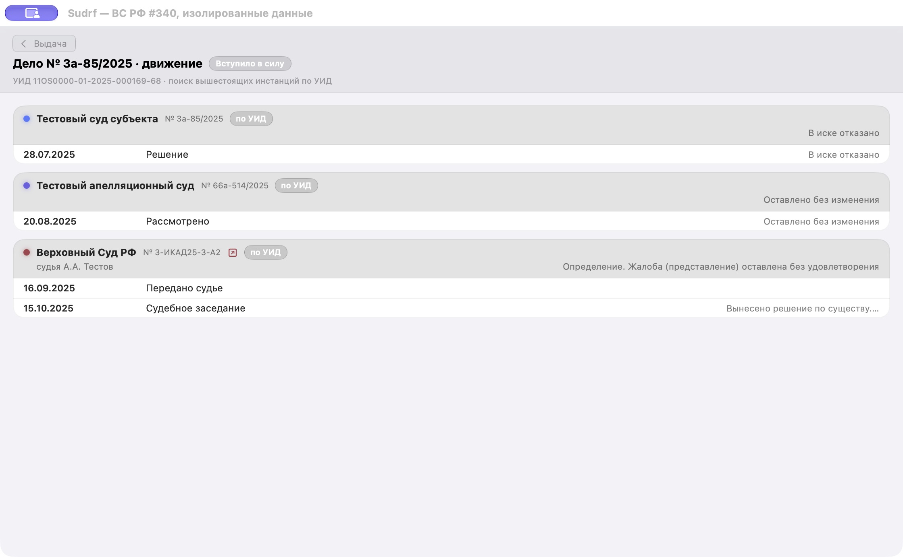

# Приёмка #340 — движение ВС РФ

30 сентября 2026 года, Xcode 27.0 (27A266a), macOS 27.2.

Проверены профильные и полные тесты: 1699 XCTest, 2 штатных пропуска, 28 Swift Testing,
0 ошибок; пересозданный Xcode-проект и сборка приложения 0.59.8 (218).
Независимый review Astra завершён без оставшихся замечаний.

- `VSRFClient` → поиск → точная карточка → `MovementService`: три события,
  полный опубликованный итог, публикация `16.09.2025 16:24` в пояснении,
  заседание `15.10.2025` без выдуманного времени.
- Раздельные отказы карточки дела и жалобы: сохранение проверенных новых строк,
  прежней истории и итогов; точное сопоставление по URL, включая `www`.
- Сохранение и повторное открытие отдельной временной SwiftData-базы: движение,
  подборка и завершённая стадия сохранены, повторное обновление не дублирует строки.
  Историческое дополнение не создаёт уведомления о старых событиях.
- В реальном `CaseMovementView` единственные назначение и результат одной даты
  показаны одной строкой «Судебное заседание». Исходные три события остаются в данных;
  неоднозначные пары и другие суды не объединяются.

## Изолированное окно

`bash Docs/qa/issue-340/run.sh` собирает `/private/tmp/SudrfVSRF340.app`
с идентификатором `ru.sudrf.qa.vsrf340`. Оно открывает только fixture-backed
`CaseMovementView`, без запуска основного приложения, запросов к судам или рабочей базы.
Пункт меню **Run checks** выполняет проверки этого представления и временного хранилища.
Проверки в GUI-host завершились без ошибок и пропусков. Снимок ниже получен через
Computer Use из собственного окна, после изменения названия и объединения строк.

Санитизированные исходники, дата получения и SHA-256:
[provenance фикстур](../../../Tests/SudrfKitTests/Fixtures/vsrf_current_340_provenance.md).
TestFlight и рабочая база для проверки не использовались.
