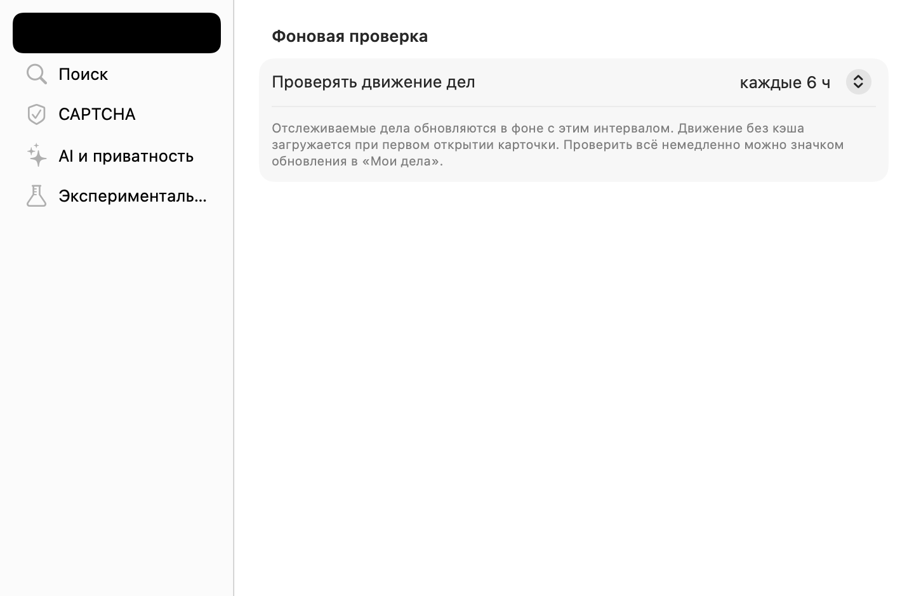
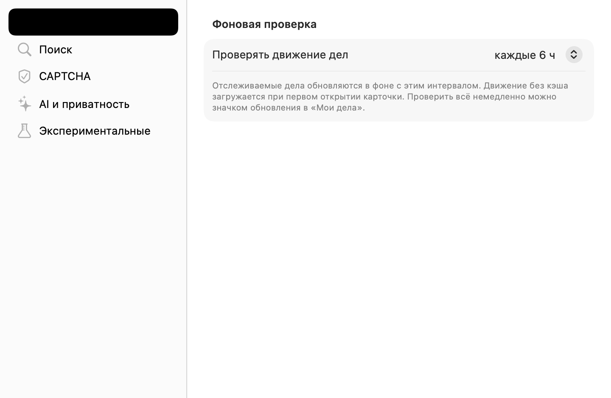
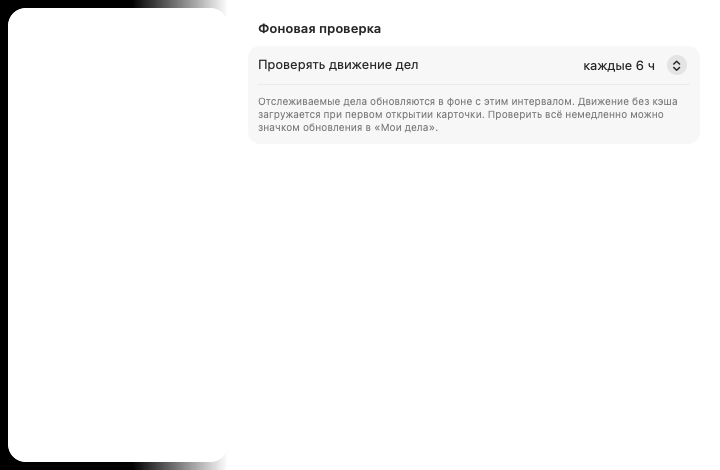

# #366 — боковая панель настроек и верхний отступ

Проверка от 7 октября 2026 года. **Обе причины исправлены; автор подтвердил окончательный результат 7 октября 2026 года (см. заключительную запись).** Пользователь подтвердил полное название боковой панели и прислал снимок оставшегося отступа 7 октября 2026 года. Первоначальная необходимость повторной приёмки разрешена заключительным подтверждением автора.

## Подтверждённое исправление

Причина обрезания — прежняя фиксированная ширина боковой панели 184 pt. При неизменном `Label` название «Экспериментальные» обрезается; минимальная и предпочтительная ширина 220 pt позволяют показать его целиком. Название сохранено; добавлены системная подсказка и явное доступное имя.

Ниже — невидимый `NSHostingView` размером 720 × 470 pt на **macOS 27.2 (26B5101f)**. Оболочка и список извлекаются из настоящего `SettingsHub.swift`; первая панель использует настоящее содержимое `RefreshSettingsPane` с тестовым `@State` вместо `@AppStorage`; четыре остальных раздела заменены синтетическими grouped Form с исходными заголовками. Пользовательские настройки, реальные AI-разделы, Keychain, база и приложение не открываются. Чёрная выбранная строка — артефакт offscreen-отрисовки, не подтверждение её внешнего вида в приложении. Изображения имеют масштаб 2×.

| До: 184 pt | После: минимум / предпочтительно 220 pt |
| --- | --- |
|  |  |

Воспроизведение из корня репозитория на macOS с Xcode:

```sh
python3 Docs/qa/issue-366/render-sidebar.py --output-dir /private/tmp/sudrf-366/qa
```

Это инструмент получения свидетельств, а не автоматический тест визуальной приёмки. Он не вызывает `orderFront`, `makeKeyAndOrderFront` или запуск Sudrf.

## Первичная проверка верхнего отступа — ограничение прежнего host

Дефект зарегистрирован на macOS 26. На доступной macOS 27.2 синтетический grouped Form в этой оболочке уже показывает первый заголовок примерно в 22 pt от верха содержимого. Общий `.frame(..., alignment: .top)`, `VStack` и `.contentMargins` в отдельном пробном host не изменили итоговое расположение. Поэтому эти неподтверждённые изменения не включены.

Дополнительная проверка выполнена на **macOS 26.6.2 (25G83), Xcode 26.6 (17F113)**: [изолированный CI-прогон](https://github.com/arvidsever/Sudrf/actions/runs/37596688780). Настоящее содержимое первой панели с тестовым состоянием также начинается примерно в 22 pt от верха. На headless runner боковой список не отрисовался; эти снимки подтверждают лишь положение формы, а не приёмку боковой панели.



Временный workflow удалён после получения свидетельств; воспроизводимый инструмент остаётся в QA. Сохранены снимки до/после с обеих систем. Ни невидимый NSHostingView, ни первая панель не доказывают поведение настоящей Settings-сцены и всех пяти разделов. Для этой оставшейся границы нужна отложенная живая проверка.

## Автоматические проверки

- SwiftPM app build: прошёл, журнал `/private/tmp/sudrf-366/build-final.log`.
- `xcodegen generate`: прошёл, журнал `/private/tmp/sudrf-366/xcodegen.log`.
- Канонический Xcode Debug app build без подписи и запуска: прошёл, журнал `/private/tmp/sudrf-366/xcodebuild.log`. Все три поставляемые CoreML-модели в собранном бандле совпали с SHA-256 manifests.
- Полная проверка SwiftPM с `-strict-concurrency=complete`: прошла; 1930 XCTest (20 штатных пропусков), 28 Swift Testing, 0 failures. Журнал `/private/tmp/sudrf-366/tests.log`.
- `git diff --check`: прошёл.

Команды используют отдельные scratch/cache/DerivedData каталоги:

```sh
swift build --scratch-path /private/tmp/sudrf-366/build --cache-path /private/tmp/sudrf-366/cache --product SudrfApp
swift test --scratch-path /private/tmp/sudrf-366/build --cache-path /private/tmp/sudrf-366/cache -Xswiftc -strict-concurrency=complete
xcodegen generate
xcodebuild -project Sudrf.xcodeproj -scheme Sudrf -configuration Debug -destination 'platform=macOS' -derivedDataPath /private/tmp/sudrf-366/XcodeDerivedData -clonedSourcePackagesDirPath /private/tmp/sudrf-366/XcodePackages CODE_SIGNING_ALLOWED=NO CODE_SIGNING_REQUIRED=NO build
```

## Сценарии повторной приёмки после первоначального снимка

На macOS 26 получить скриншоты **всех пяти настоящих разделов** («Обновление», «Поиск», «CAPTCHA», «AI и приватность», «Экспериментальные») при ширине 720 pt и стандартной ширине, в светлом и тёмном оформлении. Проверить:

- ни один пункт боковой панели не обрезан; полные названия доступны в tooltip и VoiceOver;
- первый заголовок секции начинается под заголовком окна с одинаковым обычным системным отступом во всех пяти разделах;
- длинные формы прокручиваются, настройки и кнопки доступны.

На этом этапе проверка автора ещё ожидалась; окончательное подтверждение записано ниже.

## Нативная Settings scene: воспроизведение и исправление

Пользовательский снимок от 7 октября 2026 года подтвердил дефект в настоящей Settings scene. Её системный toolbar имеет AppKit-стиль `.preference` (raw value 2), располагающий инструменты отдельной строкой под заголовком. Верхняя безопасная область равна 88 pt; окно имеет размер 720 × 558 pt при содержимом 720 × 470 pt. Прежний NSHostingView в обычном NSWindow не воспроизводил эту конфигурацию.

Изменение фиксированного frame на минимальный, Scene-модификаторы `.windowToolbarStyle(.unified/.unifiedCompact)` и View-модификаторы `.presentedWindowToolbarStyle`, `.toolbarRole(.editor)`, `.toolbarTitleDisplayMode(.inline)` не уменьшили измеренный отступ. Эти изменения не включены.

Узкий private `SettingsWindowToolbar` использует собственный `view.window` и задаёт только `.unifiedCompact`, по существующему паттерну `WindowChrome`. Заголовок, содержимое toolbar, геометрия формы и остальные окна не меняются. После исправления верхняя область — 40 pt, окно — 720 × 510 pt, содержимое остаётся высотой 470 pt.

Воспроизводимая проверка создаёт настоящее отдельное SwiftUI-приложение с Settings scene и уникальным bundle ID. Оболочка и первая форма берутся из исходников; вместо AppStorage используется State, четыре остальных раздела синтетические. Приложение Sudrf, TestFlight, пользовательская база, настройки и Keychain не открываются. Проверяются переключение пяти разделов и закрытие/повторное открытие Settings. До исправления все шесть замеров дают style 2 / top 88; после — style 4 / top 40. Неподходящий результат завершает проверку ошибкой.

```sh
python3 Docs/qa/issue-366/verify-native-settings.py --output-dir /private/tmp/sudrf-native-settings
```

Геометрия: [до](native-settings-before.json), [после](native-settings-after.json). Изображения [до](native-settings-before.png) / [после](native-settings-after.png) получены через cacheDisplay содержимого окна: чёрная боковая область и пустой toolbar — ограничения такого захвата, а не подтверждение оформления. Финальную композицию и доступность настоящих пяти разделов проверяет пользователь в собственной Xcode-сборке.

Независимый review production-правки: замечаний нет. Дополнительные наблюдатели и периодическое принудительное изменение toolbar не добавлялись: style сохраняется после всех переключений и повторного открытия в нативной проверке.

## Итоговая приёмка и выпуск — 7 октября 2026 года

После первоначального снимка с оставшимся дефектом пользователь повторно проверил исправление и разрешил слияние. Первоначальная невидимая оболочка не воспроизводила нативную Settings scene; это ограничение и последующая диагностика сохранены в QA.
Пользователь написал: «Да, всё ок. Можно обновлять main в гитхабе».
Прежние указания об отложенной приёмке выше относятся к этапу до этого подтверждения.
Полная ручная матрица VoiceOver/клавиатуры, всех ОС и тем отдельно пользователем
не подтверждалась; её прохождение не приписывается этому ответу.

Выпуск: **0.62.6 (243)**, [PR #418](https://github.com/arvidsever/Sudrf/pull/418).
Финальные проверки CI доступны на [коммите выпуска](https://github.com/arvidsever/Sudrf/pull/418/checks);
слияние выполняется только после их успеха. TestFlight и рабочая база агентом не открывались.
